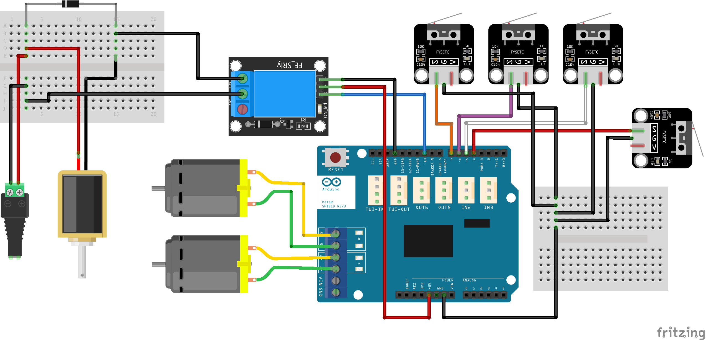
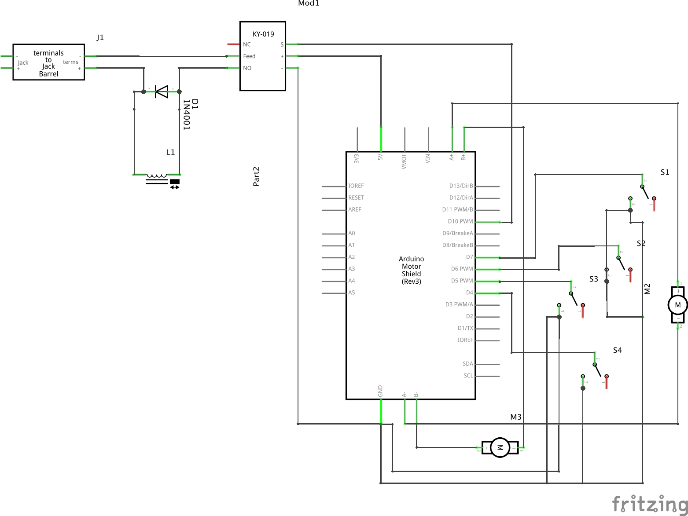

# The Claw Crane

Collaboration with artist
[Estefanía B. Flores](https://www.instagram.com/estefantastic)
for her master's thesis at
[Goldsmiths, University of London](https://www.gold.ac.uk/).

Old arcade claw crane controlled with an
[Arduino UNO](https://store.arduino.cc/arduino-uno-rev3) microcontroller board.

## Motors

There are three DC motors, but we will only use two.

They seem to be [12V Crouzet DC brush geared motors (828610)](https://soda.crouzet.com/pn/?i=82861009).

  

I used an [Arduino motor shield](https://store.arduino.cc/arduino-motor-shield-rev3)
to control them.

  

## Claw solenoid

The claw is closed using a push solenoid.

To control the claw, I used a relay module. More specifically, I used a
[SunFounder 2-Channel DC 5V Relay Module with Optocoupler Low Level Trigger Expansion Board](https://www.sunfounder.com/products/2channel-relay-module). We close the claw for 50 ms only.

A flyback diode is placed in parallel to the claw to protect the circuit.

An ohmeter says the resistance across the solenoid is 4.5 ohms, so the current
through it will be 2.67 amps, as we are using 12 V.

  

I decided to leave the jumper between Vcc and JD-Vcc in place (i.e., the current
for the relay solenoid is supplied through the Arduino pin). Ideally, though,
this voltage would come from an external power supply (good explanation
[in this video](https://youtu.be/d9evR-K6FAY)).

## Manual control

For testing, I used the joystick that comes with the Elegoo starter kit.
It seems to be a [KY-023](https://www.cricklewoodelectronics.com/Dual-axis-joystick-module-for-Arduino-KY-023.html?gclid=Cj0KCQjwh_eFBhDZARIsALHjIKda6-hFnS6d_X1JHB1WaObJxghC3TNj5pJ42rqzo3oEvcHOkOQUueAaAp14EALw_wcB).

  

More info:

- [Components101.com](https://components101.com/modules/joystick-module)
- [Arduinomodules.info](https://arduinomodules.info/ky-023-joystick-dual-axis-module/)

I use the potentiometers to control the two motors, and the push button to close
the claw.

## Links of interest

### Claw cranes

- [Holland Computers, Inc. – Crane Kit Manual – Part Number RA-CRANE-KIT](https://www.hollandcomputers.com/data/Gaming/Crane%20Kit%20Manual%20RA-CRANE-KIT-2019.pdf)
- [BBTSON MICROPROCESSOR CRANE](http://ohwow-arcade.com/Assets/Game_Manuals/BIG%20CHOICE.PDF)
- [Coast to Coast Entertainment – Stage 1 Crane Controller – D9803D4 Instructions](https://coasttocoastcranes.com/Manuals/Double%20Feature%20Manual.pdf)
- [Grayhound Electronics – The Crane Operators Manual](https://www.arcade-museum.com/manuals-vending/Grayhound_Crane_Schematics.pdf)
- [Grayhound crane dip switch settings](https://www.arcade-museum.com/manuals-vending/GrayhoundSkillCrane.pdf)
- [ArcadeControls.com – "greyhound crane claw problem"](http://forum.arcadecontrols.com/index.php?topic=111859.0)
- [Hackaday.io – Toy Claw Machine](https://hackaday.io/project/215-toy-claw-machine)
- [Fixing an 80's Drew's Tiger Paw Plush Crane Claw Machine With Schematics](https://www.youtube.com/watch?v=LLF4t5Sr2Ww)
- [Arcade Claw Machine/ Prize Game with Arduino](http://www.retrobuiltgames.com/the-build-page/arduino-claw-machine/)
- [Powering a crane/claw](https://electronics.stackexchange.com/questions/471259/powering-a-crane-claw)
- [Claw machines are rigged — here's why it's so hard to grab that stuffed animal](https://www.vox.com/2015/4/3/8339999/claw-machines-rigged)
- [Arduino Claw Machine](https://www.instructables.com/Arduino-Claw-Machine/)

### Arduino

- [DroneBot Workshop](https://www.youtube.com/channel/UCzml9bXoEM0itbcE96CB03w)
- [Paul McWhorter](https://www.youtube.com/channel/UCfYfK0tzHZTpNFrc_NDKfTA)
- [Robojax](https://www.youtube.com/channel/UCkcBSig_Iu4ZnAIeCeG1TVg)
- [Library tutorial](https://www.arduino.cc/en/Hacking/libraryTutorial)
- [Adafruit-BMP085-Library](https://github.com/adafruit/Adafruit-BMP085-Library)
- [API style guide](https://www.arduino.cc/en/Reference/APIStyleGuide)
