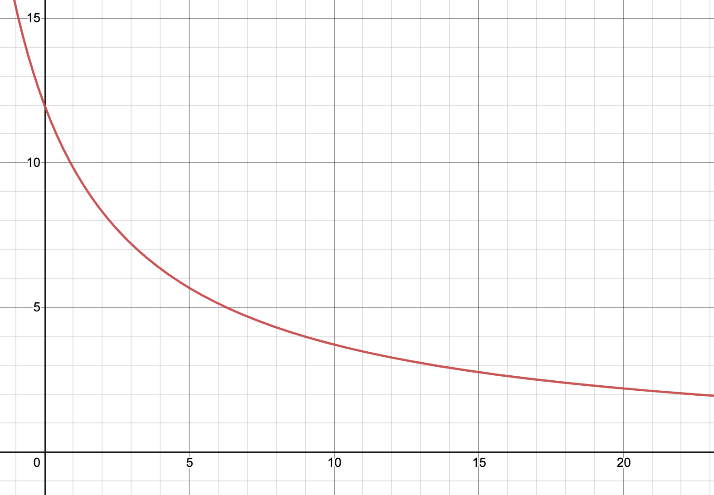

# The Claw Crane

Collaboration with artist [Estefanía B. Flores](https://www.instagram.com/estefantastic) for her master's thesis at
[Goldsmiths, University of London](https://www.gold.ac.uk/).

Old claw crane controlled with an [Arduino UNO](https://store.arduino.cc/arduino-uno-rev3) microcontroller board.

## Claw solenoid

V1 is the voltage supplied to the claw, whose resistance R1 is about 4.5 Ω.
The claw stays closed after supplying 12 V for some milliseconds, so I decided
to use a resistor in series so less than 12 V are provided to the push solenoid
inside the claw.

where

<!-- $$
V_{cc} = 12 V, R_1 = 4.5 \Omega
$$ -->

Below is a derivation of V1 as a function of R2.

<!-- $$
V_1 = V_{cc} - V_2
$$ -->

<!-- $$
V_2 = I R_2
$$ -->

<!-- $$
I = \frac{V_{cc}}{R_1 + R_2}
$$ -->

<!-- $$
V_2 = V_{cc} \frac{R_2}{R_1 + R_2}
$$ -->

<!-- $$
V_1 = V_{cc} (1 - \frac{R_2}{R_1 + R_2})
$$ -->

[Link](https://www.desmos.com/calculator/cf1kxeozzn)

The horizontal axis is R2 (in ohms). The vertical axis is V1 (in volts).

<!-- 
[Link](https://crcit.net/c/800fdfb51e4041a59e4ed74fbcc340c6) -->

<!-- A value of  Ω for R2 implies V1 =  V, which seems reasonable. -->

## Links of interest

- [Holland Computers, Inc. – Crane Kit Manual – Part Number RA-CRANE-KIT](https://www.hollandcomputers.com/data/Gaming/Crane%20Kit%20Manual%20RA-CRANE-KIT-2019.pdf)
- [BBTSON MICROPROCESSOR CRANE](http://ohwow-arcade.com/Assets/Game_Manuals/BIG%20CHOICE.PDF)
- [Coast to Coast Entertainment – Stage 1 Crane Controller – D9803D4 Instructions](https://coasttocoastcranes.com/Manuals/Double%20Feature%20Manual.pdf)
- [Grayhound Electronics – The Crane Operators Manual](https://www.arcade-museum.com/manuals-vending/Grayhound_Crane_Schematics.pdf)
- [Grayhound crane dip switch settings](https://www.arcade-museum.com/manuals-vending/GrayhoundSkillCrane.pdf)
- [ArcadeControls.com – "greyhound crane claw problem"](http://forum.arcadecontrols.com/index.php?topic=111859.0)
- [Hackaday.io – Toy Claw Machine](https://hackaday.io/project/215-toy-claw-machine)
- [Fixing an 80's Drew's Tiger Paw Plush Crane Claw Machine With Schematics](https://www.youtube.com/watch?v=LLF4t5Sr2Ww)
- [Arcade Claw Machine/ Prize Game with Arduino](http://www.retrobuiltgames.com/the-build-page/arduino-claw-machine/)
- [Powering a crane/claw](https://electronics.stackexchange.com/questions/471259/powering-a-crane-claw)
- [Claw machines are rigged — here's why it's so hard to grab that stuffed animal](https://www.vox.com/2015/4/3/8339999/claw-machines-rigged)
- [Arduino Claw Machine](https://www.instructables.com/Arduino-Claw-Machine/)
- [Adafruit-BMP085-Library](https://github.com/adafruit/Adafruit-BMP085-Library)
